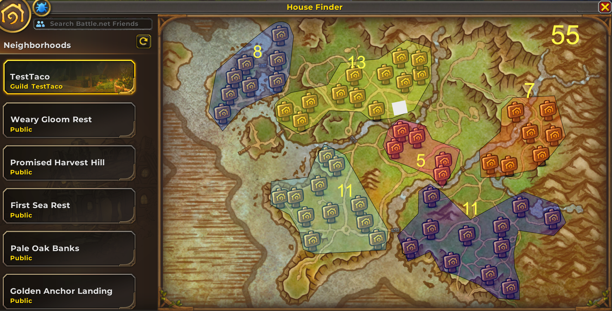
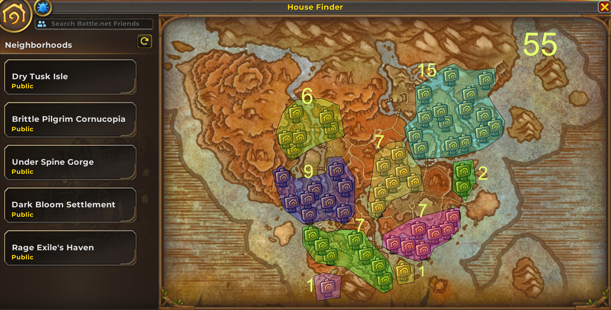
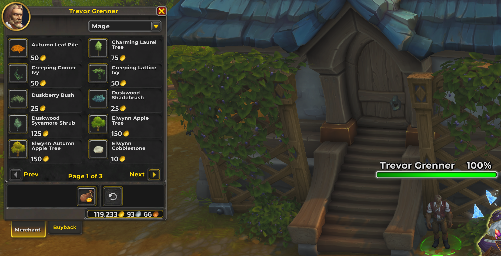
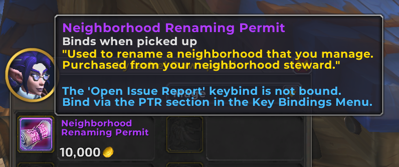
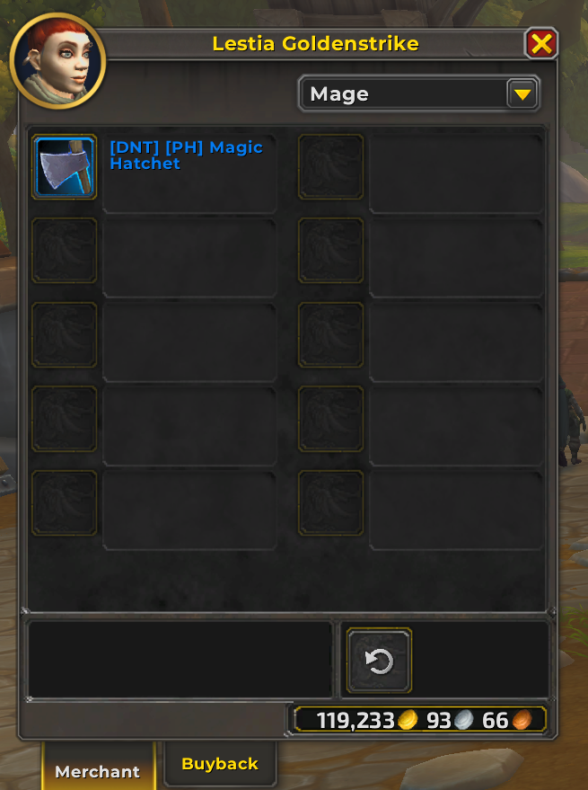
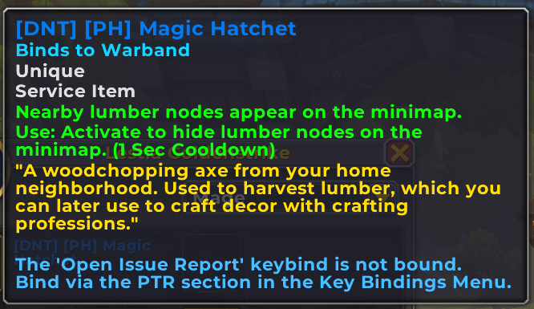

# WIP - Guild Housing Leadership Report 

## Purpose
This report is designed to inform guild leadership about the new Housing system in World of Warcraft: Midnight. It summarizes key discoveries, features, and recommendations to help manage and optimize housing for a large guild (500+ members) upon public release.

---

## 1. Neighborhood and Plot Layout
- Each neighborhood contains 55 house plots.
- Both Alliance and Horde have unique neighborhood layouts.
- Guilds can establish their own neighborhoods, providing a central hub for members.

**Visual References:**
- Alliance Layout: 
- Horde Layout: 

---

## 2. Guild Housing Mechanics
- After establishing a guild neighborhood, members must log out and back in before moving their house to the new neighborhood.
- When searching for neighborhoods, your guild appears at the top of the finder list, making it easy for members to locate and join.

---

## 3. Permissions & Access Control
Permission settings exist in guild ranks, but the full management page is not yet released.
Current permission options (subject to change):
    - **Owner:** Full control
    - **Friends:** Visit/interact, cannot change settings
    - **Guild Members:** Visit/interact, cannot change settings unless explicitly allowed
    - **Public:** Visit only, no changes
Flexible access supports both private and social playstyles.

**Visual Reference:**

### 3.1 Player Warband Access
All characters in a player's warband can visit the guild house, even if they are not in the guild. This is a player-specific feature and not a guild-wide setting.

---

## 4. Customization & Decor
- Houses can be customized: floor, walls, and roof materials are changeable.
- Decor items can be crafted or purchased from vendors (up to three pages of items per vendor).
- Large gathering spaces are available for events, with:
    - 98 audience seats
    - 15 band pit seats
    - Large stage with moving curtains

**Visual References:**
- Decor Vendor: 
- Gathering Area: 

---

## 5. Neighborhood Renaming
- NPCs (Lyssabel Dawnpetal and the Neighborhood Steward) sell a scroll to rename your guild neighborhood for further customization.

**Visual Reference:**
- 

---

## 6. Gathering & Crafting
- The Lumberjack skill is required to gather lumber for housing items.
- Learn the skill from Lestia Goldenstrike (middle of town).
- Quest rewards: Lumberjack skill, 2g 34s, 1,450 XP.
- An axe is required for gathering (see screenshots).

**Visual References:**
- Lumberjack Quest: 
- Axe:  

---

## 7. Recommendations for Large Guilds

### 7.1 Neighborhood Layers & Lot Allotment
The guild system only allows for one main guild neighborhood (NH). If the number of guild members seeking housing exceeds the 55-plot limit, the system automatically creates additional layers or sub-neighborhoods as overflow. Multiple main NHs are not possible, but this overflow system ensures all members can participate.

**Note on Layer Creation Threshold:**
It is currently unknown exactly how many lots must be occupied before a new layer is spun up. Some developer statements have mentioned an 80% occupancy threshold, but this has not been verified and may change before release. Guild leadership should be prepared for possible adjustments to this threshold and monitor official updates for confirmation.

**Key Considerations:**
- Only one main guild NH exists; overflow is handled by layers.
- Members may be distributed across several layers if demand exceeds 55 plots.

**Challenge:**
This can result in some layers being sparsely populated, which may impact community feel and event participation.

**Suggested Approach:**
1. Assign officers to track which layers are most active and which are underpopulated.
2. Encourage members to coordinate moves into the most active layers, especially when plots become available, to consolidate activity and foster community.
3. Develop a lot allotment policy (e.g., first-come, officer approval, or event-based rewards) to prioritize active members and ensure fair distribution.
4. Communicate regularly with members about available plots and the benefits of consolidating into active layers.
5. Use in-game events and social gatherings to encourage movement into the main or most active layers.

### 7.2 Additional Recommendations
- Assign officers to manage permissions and coordinate neighborhood moves.
- Use the renaming feature to clearly identify the main guild neighborhood.
- Host events in large gathering spaces to foster community.
- Encourage members to learn the Lumberjack skill for resource self-sufficiency.
- Monitor for updates on guild management features as they are released.

---

## 8. Open Questions & To-Do
- Awaiting release of full guild management page for housing.
- Need further testing on permission settings for friends, guild members, and public.
- Monitor for additional decor, crafting, and event features in future updates.

### Officer Discussion Points
- Is there a need to increase the guild roster size to accommodate more members?
- What are effective strategies for managing short-term members who join and quickly leave?
- Should the guild establish a specific period of inactivity after which members are removed from the guild and the guild housing area? If so, what should that timeframe be?

---

*Prepared by the Midnight Housing Testing Team*
