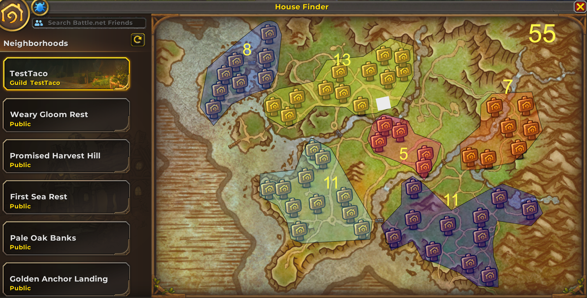
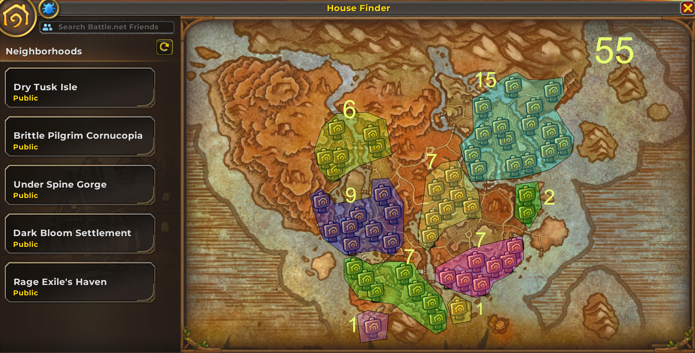
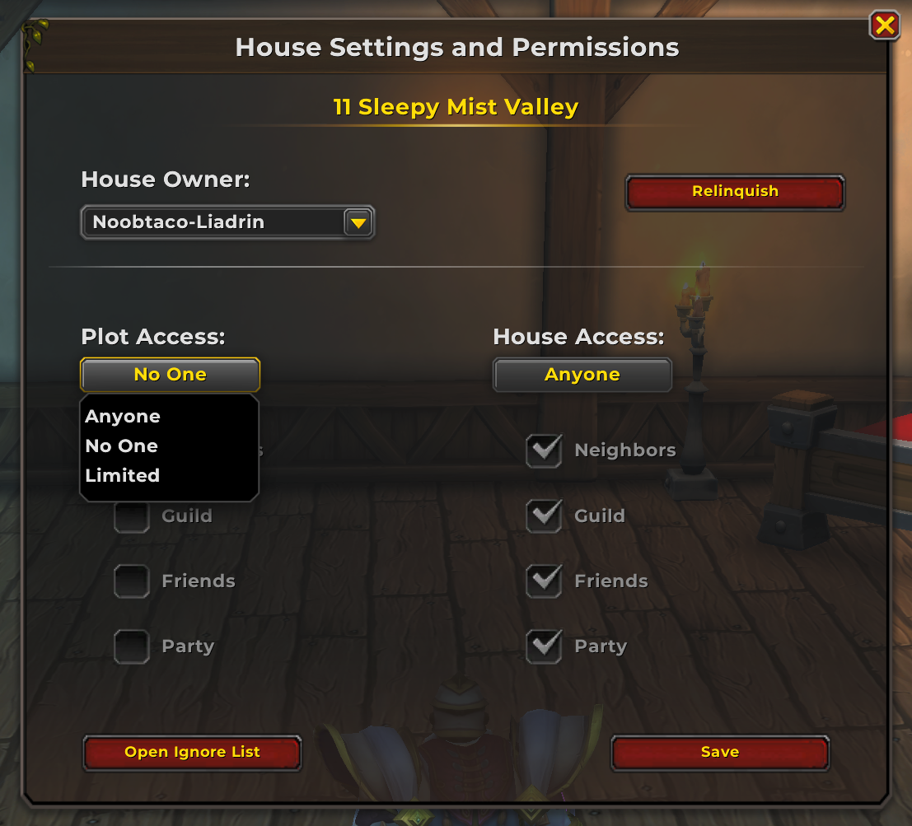
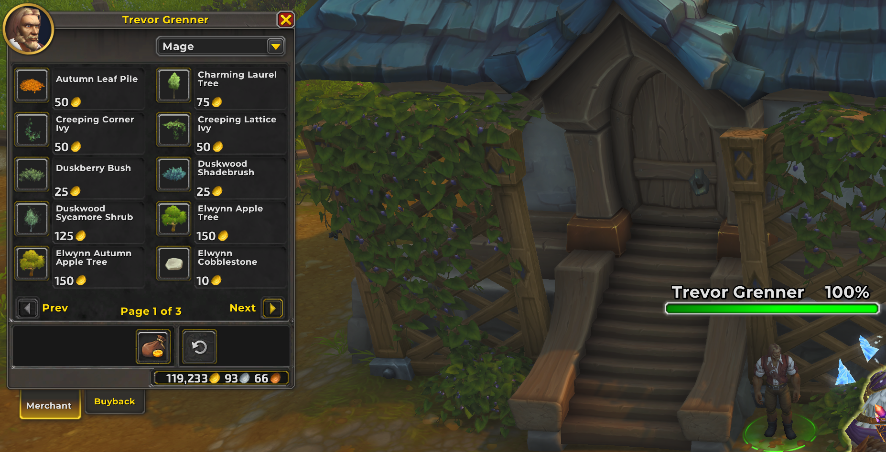
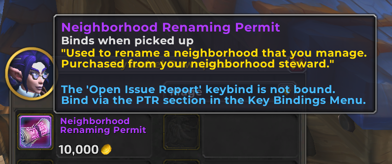
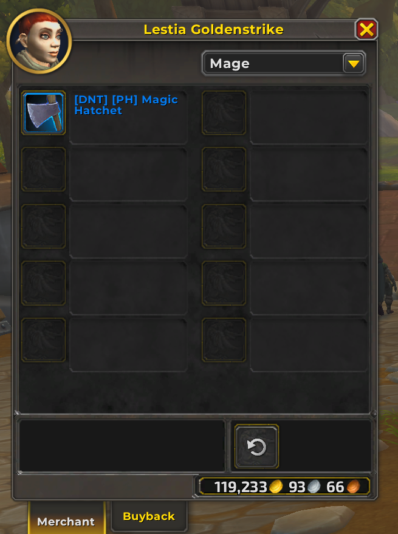
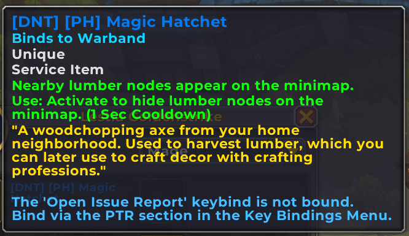

# WIP - Guild Housing Leadership Report

## Purpose

This report is designed to inform guild leadership about the new Housing system in World of Warcraft: Midnight. It summarizes key discoveries, features, and recommendations to help manage and optimize housing for a large guild (500+ members) upon public release.

## 1. Neighborhood and Plot Layout

- Each neighborhood contains 55 house plots.
- Both Alliance and Horde have unique neighborhood layouts.
- Guilds can establish their own neighborhoods, providing a central hub for members.

**Visual References:**

- Alliance Layout: 
- Horde Layout: 

---

## 2. Guild Housing Mechanics

- After establishing a guild neighborhood, members must log out and back in before moving their house to the new neighborhood.
- When searching for neighborhoods, your guild appears at the top of the finder list, making it easy for members to locate and join.

**Important Access Information:**

- Members will NOT be able to move into a house unless they have pre-purchased the Midnight expansion.
- Housing is scheduled to be enabled during the prepatch (version 11.2.7), which is estimated to release on December 2.

---

## 3. Permissions & Access Control

Permission settings exist in guild ranks, but the full management page is not yet released.

### Per House permissions
Current permission options (subject to change):
    - **Owner:** Full control
    - **Friends:** Visit/interact, cannot change settings
    - **Guild Members:** Visit/interact, cannot change settings unless explicitly allowed
    - **Public:** Visit only, no changes
Flexible access supports both private and social playstyles.

**Visual Reference:**

### 3.1 Player Warband Access

All characters in a player's warband can visit the guild house, even if they are not in the guild. This is a player-specific feature and not a guild-wide setting.

---

## 4. Customization & Decor

- Houses can be customized: floor, walls, and roof materials are changeable.
- Decor items can be crafted or purchased from vendors (up to three pages of items per vendor).
- Large gathering spaces are available for events, with:
  - 98 audience seats
  - 15 band pit seats
  - Large stage with moving curtains

**Visual References:**

- Decor Vendor: 
- Gathering Area: 

---

## 5. Neighborhood Renaming

- NPCs (Lyssabel Dawnpetal and the Neighborhood Steward) sell a scroll to rename your guild neighborhood for further customization.

**Visual Reference:**

- 

---

## 6. Gathering & Crafting

- The Lumberjack skill is required to gather lumber for housing items.
- Learn the skill from Lestia Goldenstrike (middle of town).
- Quest rewards: Lumberjack skill, 2g 34s, 1,450 XP.
- An axe is required for gathering (see screenshots).

**Visual References:**

- Lumberjack Quest: 
- Axe:  

---

## Endeavors

Endeavors — These will not be a requirement to be part of the guild housing. We do not require participation in raiding, mythics, normal runs, delves, or any other specific in-game activity. Completing Endeavors will be entirely up to each guild member.

That said, since we haven’t seen what Endeavors will be like yet, I’m hopeful that all guild housing members will want to take part in them once they’re available!

## 7. Recommendations for Large Guilds

### 7.1 Neighborhood Layers & Lot Allotment

The guild system only allows for one main guild neighborhood (NH). If the number of guild members seeking housing exceeds the 55-plot limit, the system automatically creates additional layers or sub-neighborhoods as overflow. Multiple main NHs are not possible, but this overflow system ensures all members can participate.

**Note on Layer Creation Threshold:**
It is currently unknown exactly how many lots must be occupied before a new layer is spun up. Some developer statements have mentioned an 80% occupancy threshold, but this has not been verified and may change before release. Guild leadership should be prepared for possible adjustments to this threshold and monitor official updates for confirmation.

**Key Considerations:**

- Only one main guild NH exists; overflow is handled by layers.
- Members may be distributed across several layers if demand exceeds 55 plots.

**Challenge:**
This can result in some layers being sparsely populated, which may impact community feel and event participation.

**Suggested Approach:**

1. Assign officers to track which layers are most active and which are underpopulated.
2. Encourage members to coordinate moves into the most active layers, especially when plots become available, to consolidate activity and foster community.
3. Develop a lot allotment policy (e.g., first-come, officer approval, or event-based rewards) to prioritize active members and ensure fair distribution.
4. Communicate regularly with members about available plots and the benefits of consolidating into active layers.
5. Use in-game events and social gatherings to encourage movement into the main or most active layers.

### 7.2 Additional Recommendations

- Assign officers to manage permissions and coordinate neighborhood moves.
- Use the renaming feature to clearly identify the main guild neighborhood.
- Host events in large gathering spaces to foster community.
- Encourage members to learn the Lumberjack skill for resource self-sufficiency.
- Monitor for updates on guild management features as they are released.
- Create dedicated Discord channels to help members with neighborhood and house issues during the release period. This will streamline support and ensure questions are answered quickly.

---

## 8. Open Questions & To-Do

- Awaiting release of full guild management page for housing.
- Need further testing on permission settings for friends, guild members, and public.
- Monitor for additional decor, crafting, and event features in future updates.

### Officer Discussion Points

- Is there a need to increase the guild roster size to accommodate more members?
- What are effective strategies for managing short-term members who join and quickly leave?
- Should the guild establish a specific period of inactivity after which members are removed from the guild and the guild housing area? If so, what should that timeframe be?

---

## Call to Action: Guild Member Participation

9. **Guild participation in the next PTR:**
  - If there is another open PTR event, we encourage as many members as possible to log into the PTR and be invited into the guild. This will allow us to test the layering effect and give everyone a chance to view available plots and make a house.

10. **Guild participation in open Beta:**
   - To participate in the open Beta, you must have pre-purchased the Midnight expansion.
   - When the open Beta begins, we will need 5 people to help create the guild and 5 more (for a total of 10) to establish the guild housing. Afterward, all interested members will be invited into the Beta guild for further housing system testing.

---

**Note on Beta Release Date:**

The beta release date for World of Warcraft: Midnight is not yet confirmed, but it is expected to begin sometime after the alpha testing period, potentially starting the week of November 17, 2025. Beta access is a perk of pre-purchasing the expansion.

---

## WIP: Guild Activity & Retention Policy

**Effective Date: TBA**

### 1. Purpose

To ensure a vibrant and active community, especially within the new Guild Neighborhood, we are implementing the following activity policy. This policy aims to keep our shared spaces populated by active members while providing a clear and fair process for members who take a break from the game.

### 2. Policy for Members with Guild Housing

This policy will take effect with the launch of the *Midnight* expansion.

- **Rule:** Members who occupy a guild housing plot and have not logged in for **two (2) months** will be removed from the guild roster. (or plot if tools are provided *update this once we know more!)
- **Reason:** This policy is necessary to free up housing plots for other active members, ensuring our Guild Neighborhood remains a lively and engaging community hub.
- **Your Property is Safe:** Your house, items, and progress are **not lost**. The game automatically places your home and its contents into a secure housing storage.
- **How to Return:** You are always welcome back. Upon your return to the game, simply request a guild invite. Once you rejoin, you can go to the Guild Neighborhood, select any available plot, and replace your house from storage.

### 3. Policy for Members Without Guild Housing

This policy is effective immediately.

- **Rule:** Members who do not occupy a guild housing plot will be removed from the guild roster after **one (1) year** of inactivity.
- **Reason:** This is a standard guild management practice to maintain a roster of active, current members.

### 4. Returning to the Guild

We understand that real life comes first. Removal for inactivity is not a punishment, and we are happy to welcome returning members.

If you have been removed under this policy, please contact an Officer or Guild Master for a new invitation. All of your progress and property will be waiting for you.

---

## Alliance Housing Thread & Ongoing Discussion

After Sunday's meeting, we will start a Housing Thread in #Alliance where members can post any questions not already answered in this Housing Report. Please note that this is an ongoing, evolving project by Blizzard, and there are many questions that cannot be answered at this time. We encourage everyone to participate and stay engaged as new information becomes available.

---
*Prepared by the Midnight Housing Testing Team*
