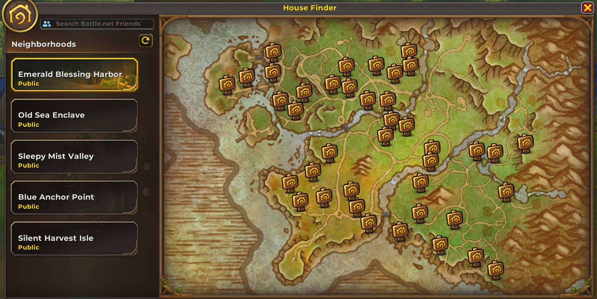
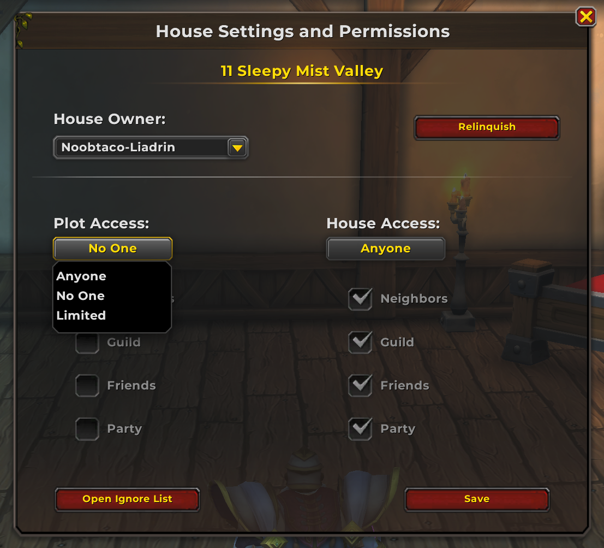

### Large Gathering Spaces
There are great large areas available in the housing system, suitable for hosting large gatherings, social events, or shows.
Seating
* 98 seats for the audiance.
* 15 seats in the band pit
The stage is large and the curtains move.

#### Example Screenshots

### Plot Layout

# Housing Information Discoveries

This document is for tracking discoveries, notes, and findings related to the new Housing system in World of Warcraft: Midnight.

## Overview
- Use this file to record any new information, quirks, bugs, or undocumented features found while testing or exploring the housing system.

## Discoveries

### House Settings and Permissions
### Customization: Floor, Walls, and Roof Materials
You can change the material style of the floor, walls, and roof in your house. This allows for further personalization and theming of your home environment.
We have control over who can have access to our house. The available options for house permissions are shown in the image below.

#### Permission Options (from image)
- Owner: Full control over the house and all settings.
- Friends: Can visit and interact with the house, but cannot change settings. **??Needs more testing**
- Guild Members: Can visit and interact, but cannot change settings unless given explicit permission.**??Needs more testing**
- Public: Anyone can visit, but cannot make changes.**??Needs more testing**

> These options allow for flexible control over who can enter, interact, or modify your house, supporting both private and social playstyles.

## Notes
- 

## Screenshots
- 
