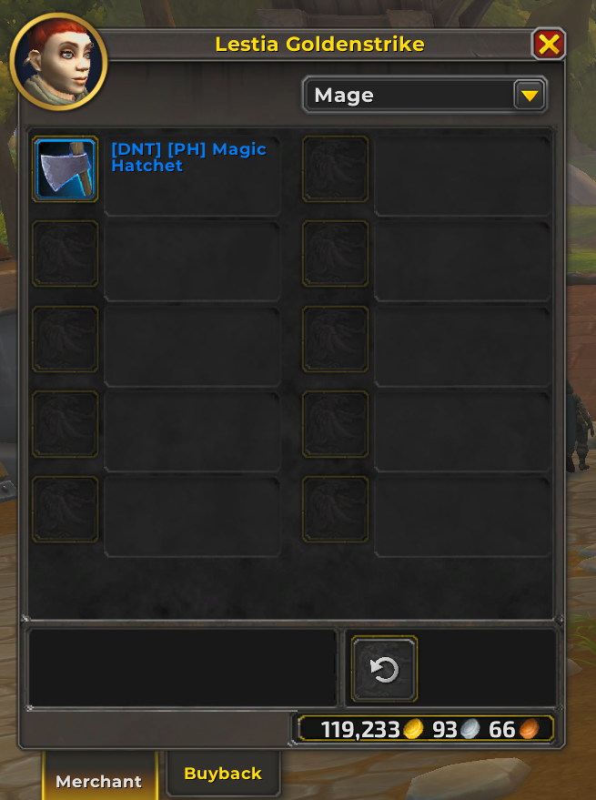

## Guild Housing Finds

### Plot Layout
**Note:** Each neighborhood has 55 spaces for houses.

#### Alliance Neighborhood Plot Layout

#### Horde Neighborhood Plot Layout

### Guild Housing Issues
- Once the guild neighborhood is established, you need to log out and back in before you can move your house to that neighborhood.

## Guild Housing Finds

### Guild Finder Behavior
When searching for neighborhoods, your Guild appears at the top of the finder list, making it easy to locate and join your Guild's housing area.

### Guild Management and Permissions
* All of your characters in your warband can visit your guild house without being in the guild.
* We discovered a permission setting in the guild ranks settings that refers to a guild management page. However, that has not been released yet, so we do not know what can be changed or updated.
* Endeavors and any controls to that are not enabled for testing yet.

#### Neighborhood Renaming
The NPC Lyssabel Dawnpetal, followed by the Neighborhood Steward, sells a renaming scroll that allows you to rename your guild neighborhood. This is useful for customizing your guild's housing area name.

### Large Gathering Spaces
There are great large areas available in the housing system, suitable for hosting large gatherings, social events, or shows.
Seating
* 98 seats for the audience.
* 15 seats in the band pit.
The stage is large, and the curtains move.

#### Example Screenshots

# Housing Information Discoveries

This document is for tracking discoveries, notes, and findings related to the new Housing system in World of Warcraft: Midnight.

## Overview
- Use this file to record any new information, quirks, bugs, or undocumented features found while testing or exploring the housing system.

## Discoveries

### House Settings and Permissions
### Customization: Floor, Walls, and Roof Materials
You can change the material style of the floor, walls, and roof in your house. This allows for further personalization and theming of your home environment.

We have control over who can have access to our house. The available options for house permissions are shown in the image below.

#### Permission Options (from image)
- Owner: Full control over the house and all settings.
- Friends: Can visit and interact with the house, but cannot change settings. **??Needs more testing**
- Guild Members: Can visit and interact, but cannot change settings unless given explicit permission.**??Needs more testing**
- Public: Anyone can visit, but cannot make changes.**??Needs more testing**

> These options allow for flexible control over who can enter, interact, or modify your house, supporting both private and social playstyles.

## Notes

## Decor – Crafted and Purchased

This section covers decor items and recipes discovered during testing for creating and purchasing housing items. Document any new crafting recipes, materials, processes, or vendor-purchased decor that relate to housing customization, furniture, decorations, or other placeable objects.

### Decor Vendors

Several NPCs around the town center now sell a wide variety of decor items for housing. Many vendors offer up to three pages of items, including furniture, decorations, and other placeable objects to personalize your home.

#### Example Screenshot

### Lumber Gathering Skill: Lumberjack

You can learn the Lumberjack skill, which allows you to gather lumber for crafting housing items. This skill is obtained from an NPC named Lestia Goldenstrike, located in the middle of town. The quest teaches you how to identify trees suitable for gathering lumber, which is used for various housing recipes and construction.

**Quest Rewards:**
- Unlocks the Lumberjack skill
- 2 gold, 34 silver
- 1,450 experience

Lumber is a key material for crafting furniture and other housing items.

#### Example Screenshot

-
#### Axe for Lumber Gathering
To gather lumber, you will need an axe. The axe is shown in the following screenshots:

