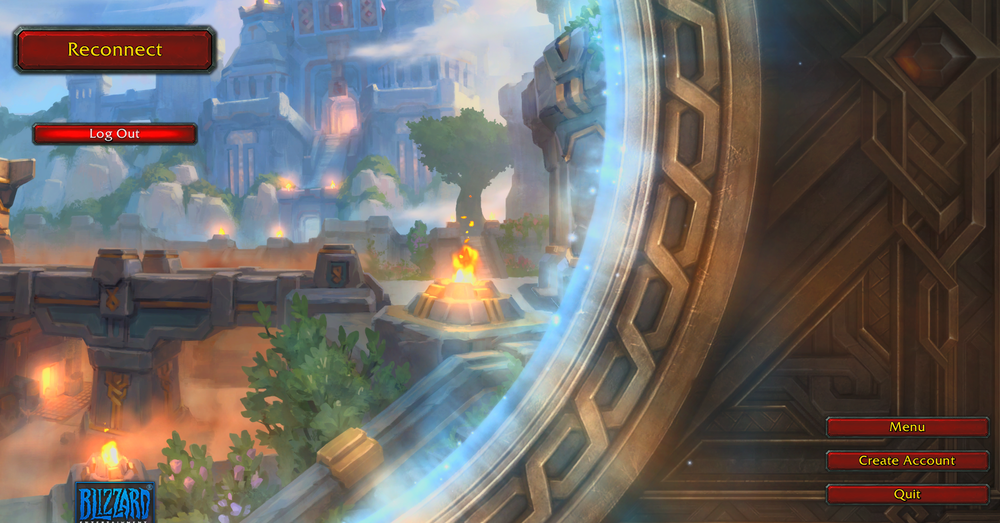
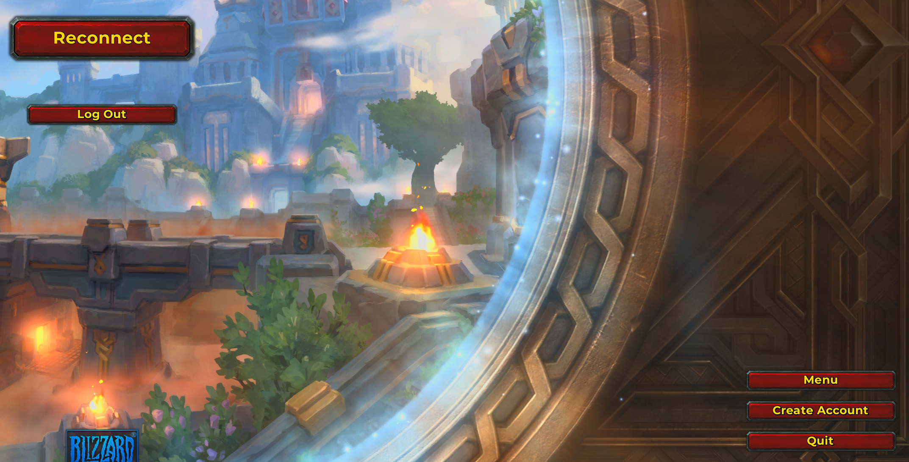
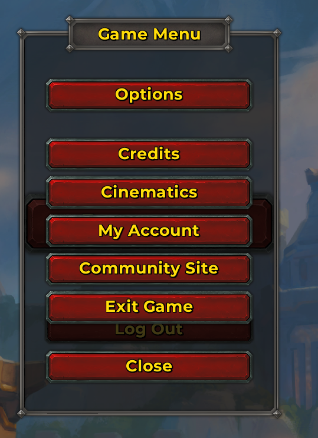
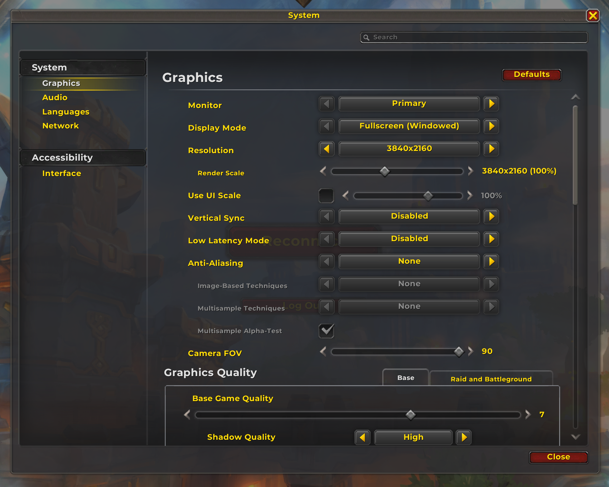

# Test Case TC-001: External Fonts Directory Compatibility

## Objective
Verify that the addon and game use the default World of Warcraft fonts when no custom fonts are present, and that replacing the external fonts directory with new fonts correctly updates the in-game fonts.

## Prerequisites
- Access to the World of Warcraft installation and addon directories
- Ability to launch the game and observe UI font changes
- Backup of the original fonts directory (recommended)

## Steps
### Scenario 1: No Custom Fonts Present
1. Ensure the external fonts directory (e.g., `Interface/AddOns/YourAddon/fonts/` or `Interface/fonts/`) is empty or contains only the default WoW font files.
2. Launch World of Warcraft.
3. Log in and observe the UI and any relevant addon text.

#### Expected Result
- All UI and addon text should use the default World of Warcraft fonts.

#### Actual Result
- Default fonts are as expected. All UI and addon text use the default World of Warcraft fonts.

#### Status
Scenario 1: [x] Pass

#### Notes
- [Add any observations or screenshots.]

##### Before Screenshots

---

### Scenario 2: Replace Fonts Directory with Custom Fonts
1. Close World of Warcraft if running.
2. Replace the contents of the external fonts directory with new custom font files (ensure they are named to match the expected font file names, e.g., `FRIZQT__.TTF`, `ARIALN.TTF`, etc.).
3. Launch World of Warcraft.
4. Log in and observe the UI and any relevant addon text.

#### Expected Result
- All UI and addon text should now use the new custom fonts provided in the external fonts directory.

#### Actual Result
- Font replacement works for the System Menu, Options screen, and in-game UI (see screenshots below).
- In-game font replacement confirmed. All UI and addon text use the new custom fonts as expected.

#### Status
Scenario 2: [x] Pass

#### Notes
- System, menu, and in-game font replacement all work as expected with the new custom fonts.
- No issues observed. All relevant UI elements use the custom fonts.

##### After Replacement Screenshots

---

## Date Tested
2025-10-03

## Tester
NoobTaco
